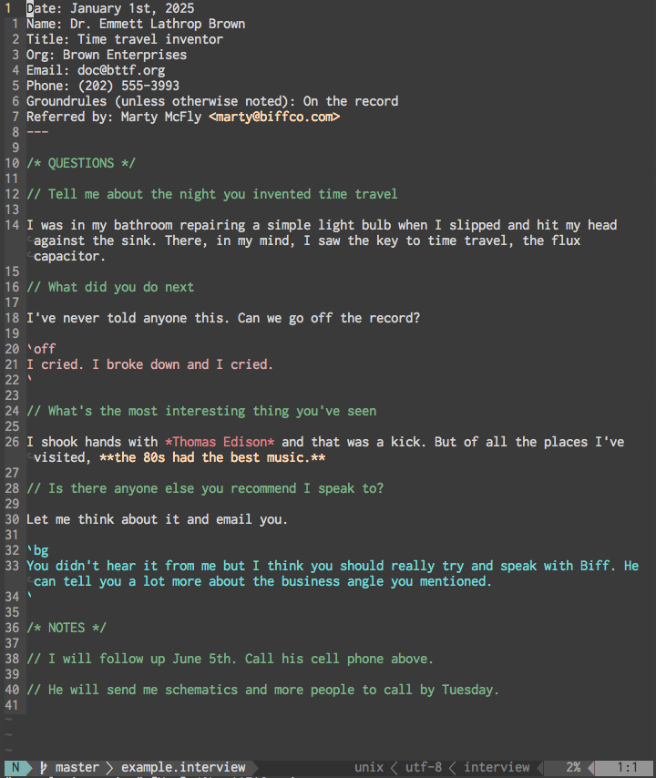
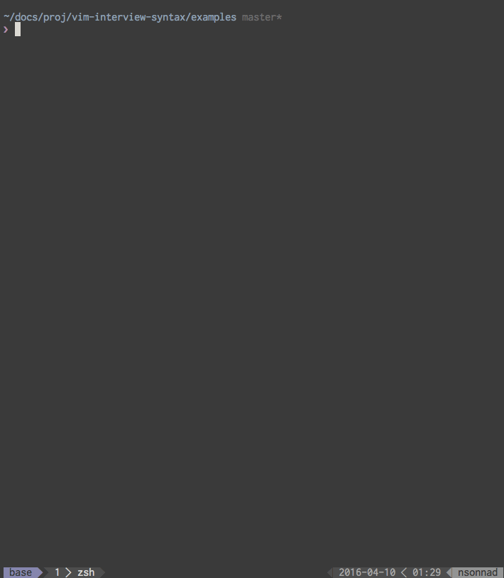
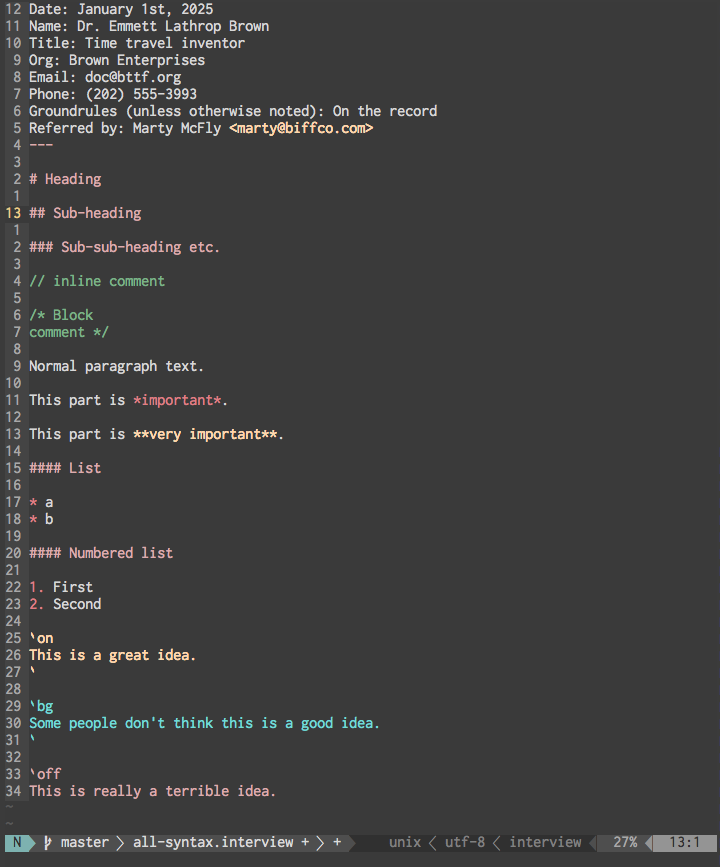

## vim-interview-syntax

This is a vim port of Michael Keller's [Submile interview syntax](https://github.com/mhkeller/sublime-interview-syntax).

#### Who it's for

(As Michael writes)

If you already develop in Vim, this can be a useful tool to give more structure and verifiability to interviews you conduct.

If you're a reporter who doesn't program, it can perform the above but also be a useful starting point to familiarize yourself with a text editor.

#### What it looks like

Here's a screenshot with the [zenburn](https://github.com/jnurmine/Zenburn) colorscheme.

#### How to use it

Once you've installed the plugin (see below), you can just open/save any file as `.interview` or `.vw` in vim. You can also load the provided new interview snippet into your favorite snippet manager, for example [neosnippet](https://github.com/Shougo/neosnippet.vim):

This will load up a new template for an interview, where you can specify its metadata. Then just use the syntax for questions, headings, on/off the record, background, and more.

#### Styling for on the record, on background or off the record

Generally, the interview has ground rule terms for how the person wants to be attributed. Interviews can get tricky, however, when the interviewee jumps back and forth. As shown in the screenshot above, you can highlight different regions by surrounding them with tick marks ( ` ) and adding either the on, bg or off keywords.

    `on
    This is on the record
    `

    `bg
    This is on background
    `

    `off
    This is off the record
    `

#### Shortcuts

TODO (maybe some simple leader mappings?)

#### Installation

Install using your plugin manager of choice. I recommend [Plug](https://github.com/junegunn/vim-plug)

Add to vimrc:

    Plug 'nsonnad/vim-interview-syntax'

And install:

    :source %
    :PlugInstall

To use the new interview snippet, you may need to tell your snippet manager where to find it, for example with neosnippet:

    let g:neosnippet#snippets_directory='~/.vim/bundle/vim-interview-syntax/snippets'

#### Full syntax sample

#### Writing in vim

Writing in vim can be a bit of a pain out of the box, but they can be overcome with a couple tiny plugins that allow you to use the best of vim in a more writing-friendly environment. Add [vim-pencil](https://github.com/reedes/vim-pencil) for easier line breaks and formatting, and consider [goyo](https://github.com/junegunn/goyo.vim) for distraction-free vim.
